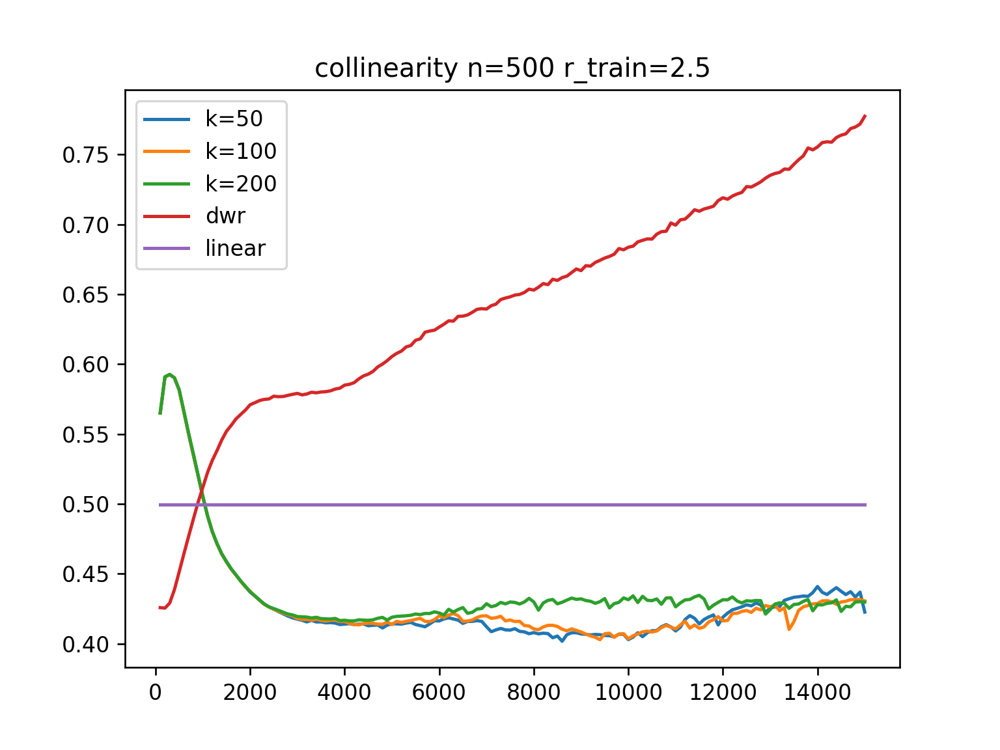
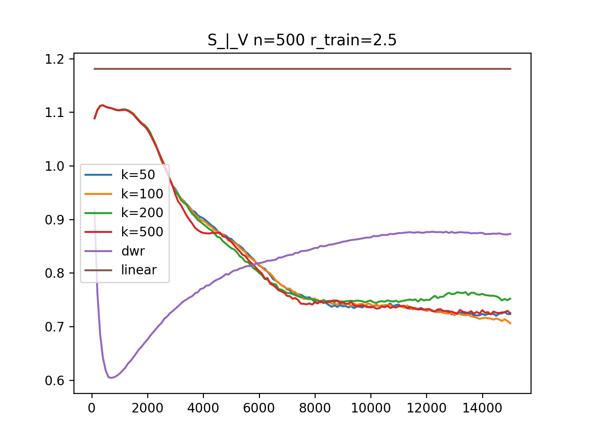
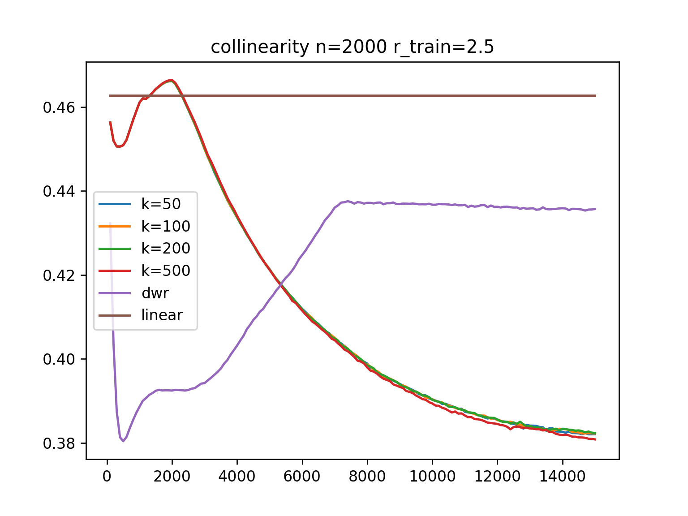
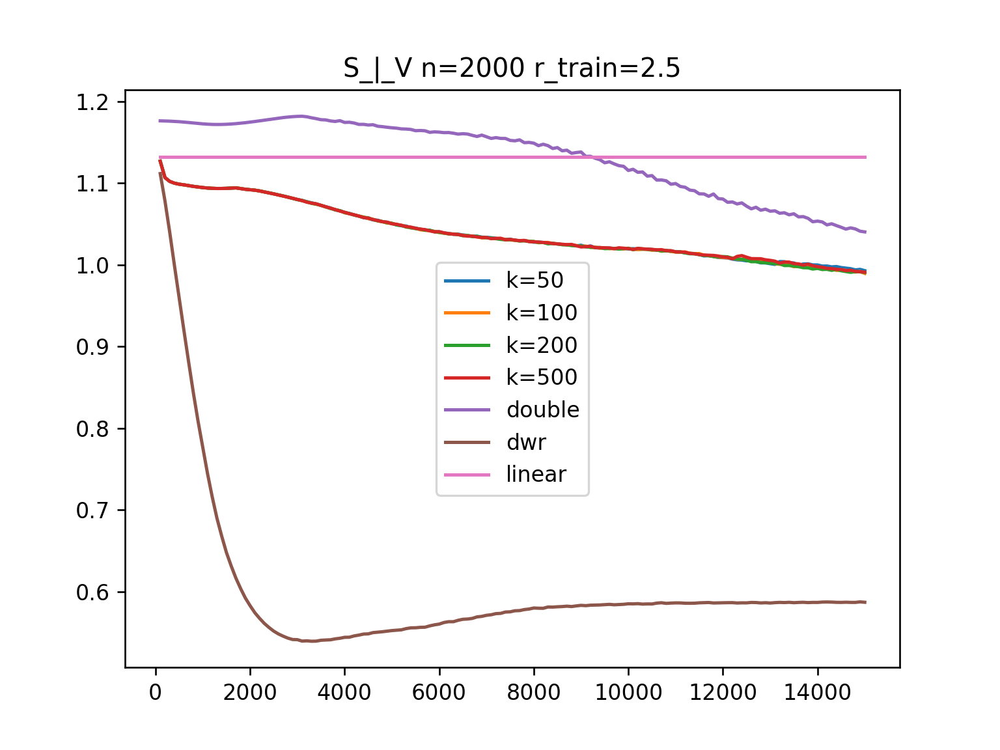

# Using MLP as M model
## configurations:
- double layers, r_train=2.5
- hidden layer size = 10
- loss = decorr_loss +  k * predict_loss  - 100 * torch.sum(weight[weight < 0])
## conclusions:
- 比较小的hidden layer size能让表现更稳定一些
- 除了n较大时的S_|_V,S->V, 其余setting下都比DWR明显好
- 超参数k影响比较小
### n=500
#### collinearity

#### S_|_V

#### V->S
S_n=500.png" alt="" width="400">

#### S->V
V_n=500.png" alt="" width="400">

### n=2000
#### collinearity

#### S_|_V

#### V->S
S_n=2000.png" alt="" width="400">

#### S->V
V_n=2000.png" alt="" width="400">

