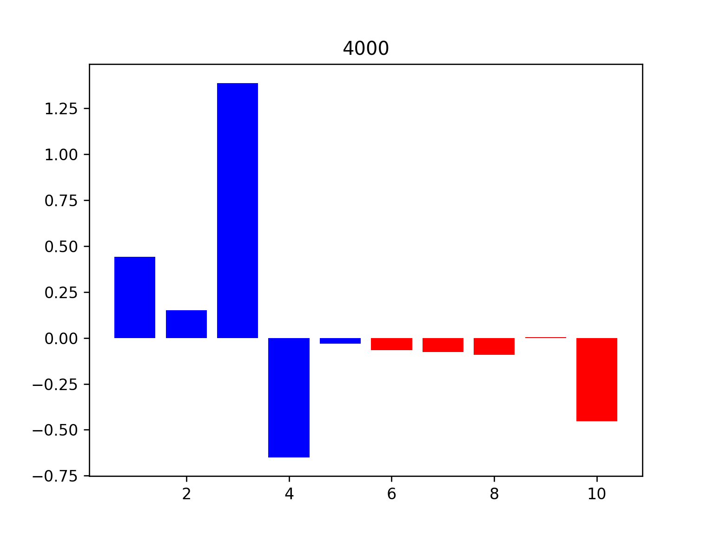

左侧是我们的版本，右侧是fake dwr版本

1000,4000,12000对应迭代次数
## 优势setting分析
### (collinearity n=100)

    
    

    
    

    
    

1. 我们的方法能在S上产生更好的分布。
前五维的权重更**均匀**，且随迭代次数**稳定**

2. 我们的方法能把V上的权重去除的更干净
### (collinearity n=500)同理

    
    

### (S->V n=100)
- 我们的方法在去除虚假关联上更弱，但是表现更好？
- 也许只能用S上的分布更好来解释？

    V_n=100.png" alt="" width="300">

    V/n=100_1000.png" alt="" width="300">
    V/n=100_1000.png" alt="" width="300">

    V/n=100_4000.png" alt="" width="300">
    V/n=100_4000.png" alt="" width="300">

    V/n=100_12000.png" alt="" width="300">
    V/n=100_12000.png" alt="" width="300">

