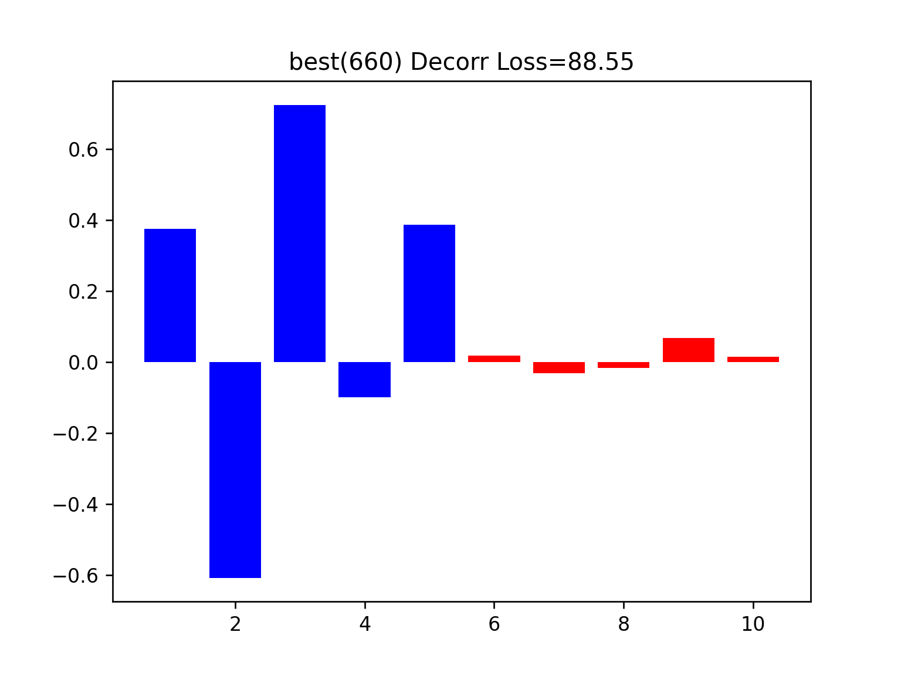
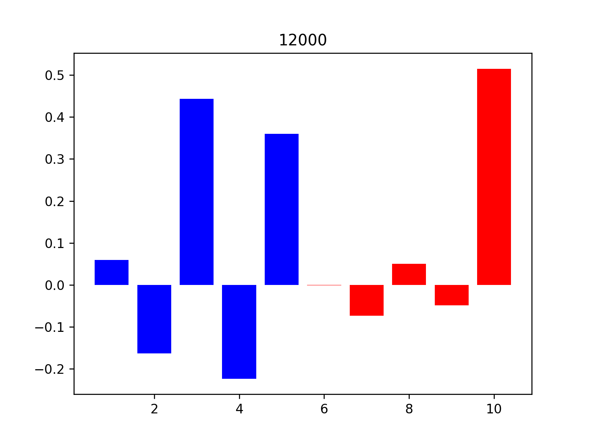
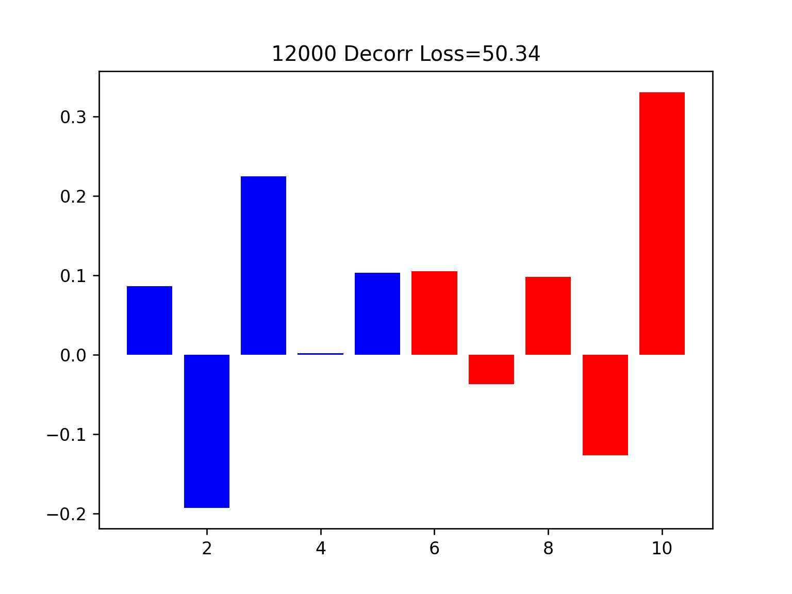

左侧是我们的版本，右侧是fake dwr版本，最右侧是dwr

1000,4000,12000对应迭代次数
## discrete版本
### (collinearity n=100)

    
    
    

    
    
    

### (S->V n=100)

    V_n=100.png" alt="" width="300">

    V/true_n=100_1000.png" alt="" width="300">
    V/n=100_1000.png" alt="" width="300">
    V/n=100_best.png" alt="" width="300">

    V/true_n=100_4000.png" alt="" width="300">
    V/n=100_4000.png" alt="" width="300">
    V/n=100_4000.png" alt="" width="300">

**我们的方法不仅在V上的权重更小了，在S上的分布也和DWR best更像，且随迭代次数稳定。**

## MLP版本 我们的优势setting
### (collinearity n=100)

    
    
    

    
    
    

    
    
    

1. 我们的方法能在S上产生更好的分布。
前五维的权重更**均匀**，且随迭代次数**稳定**

1. 我们的方法能把V上的权重去除的更干净（但似乎仅限这个setting）
### (collinearity n=500)同理

    

    
    
    

### (S->V n=100)
- 我们的方法在去除虚假关联上更弱，但是表现更好？
- 也许只能用S上的分布更好来解释？(我们蓝色的柱子始终和DWR best一样)

    V_n=100.png" alt="" width="300">

    V/n=100_1000.png" alt="" width="300">
    V/n=100_1000.png" alt="" width="300">
    V/n=100_best.png" alt="" width="300">

    V/n=100_4000.png" alt="" width="300">
    V/n=100_4000.png" alt="" width="300">
    V/n=100_4000.png" alt="" width="300">

    V/n=100_12000.png" alt="" width="300">
    V/n=100_12000.png" alt="" width="300">
    V/n=100_12000.png" alt="" width="300">

## 劣势setting

### (S_|_V n=100)

    

    
    
    

    
    
    

