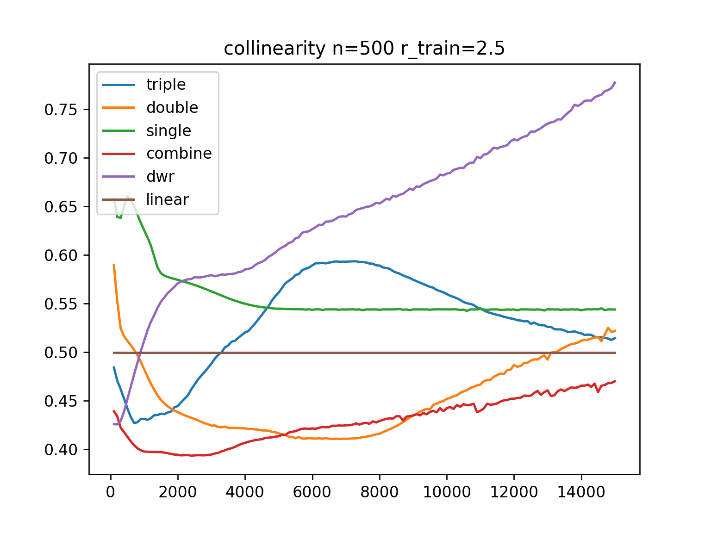
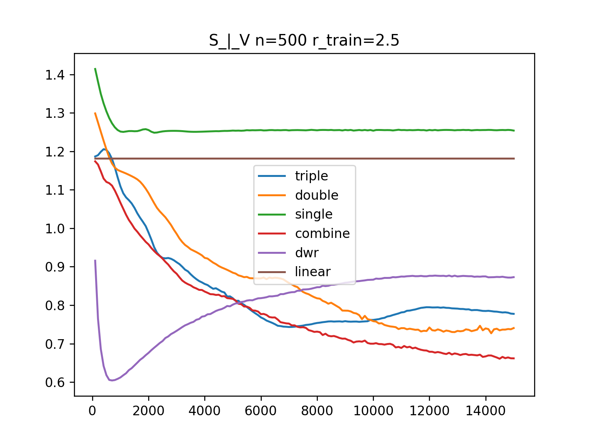
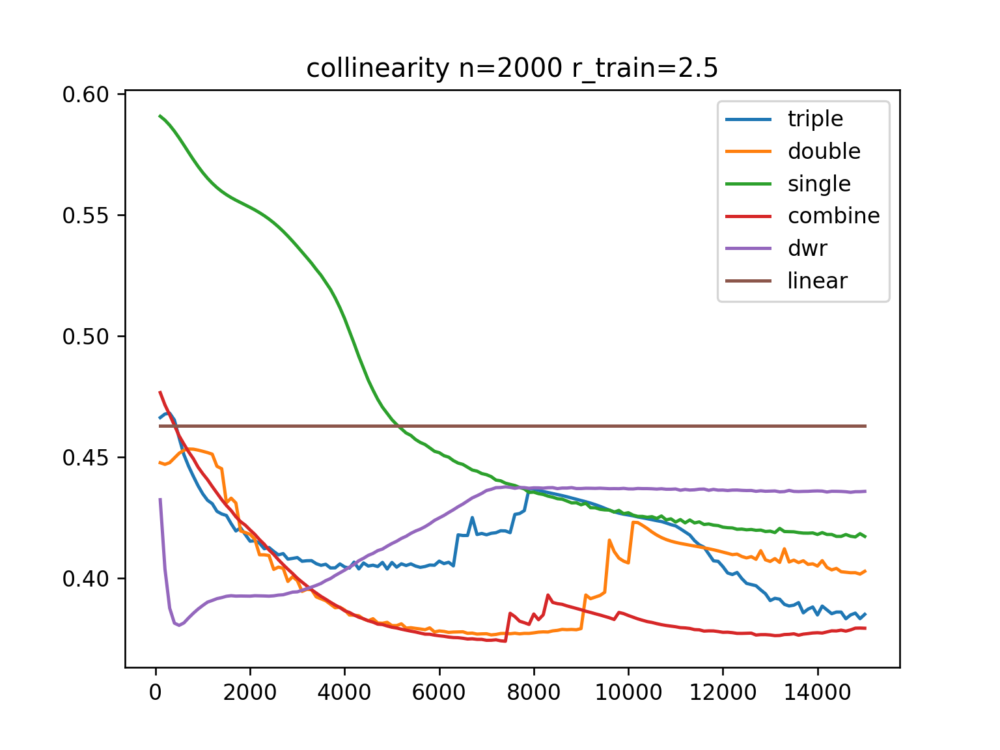
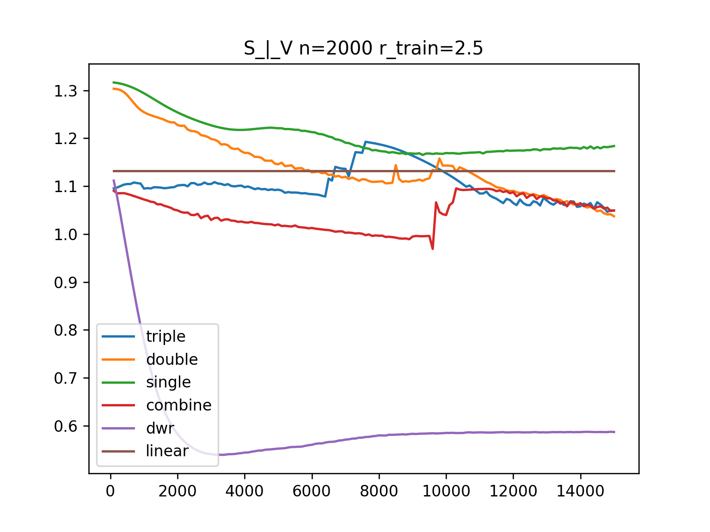

# Using MLP as M model
## Only decorrelation loss
### n=500 r_train=2.5
#### collinearity

#### S_|_V

#### V->S
S_n=500.png" alt="" width="400">

#### S->V
V_n=500.png" alt="" width="400">

### n=2000 r_train=2.5
#### collinearity

#### S_|_V

#### V->S
S_n=2000.png" alt="" width="400">

#### S->V
V_n=2000.png" alt="" width="400">

