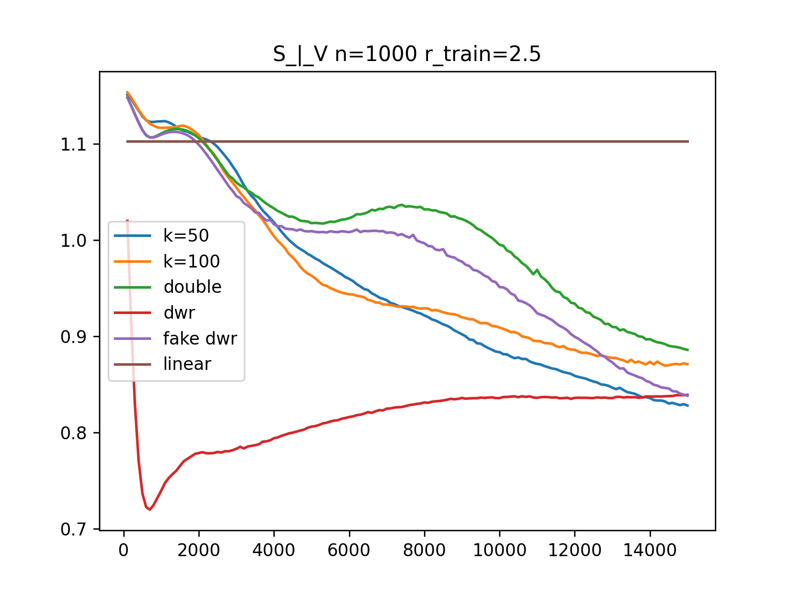
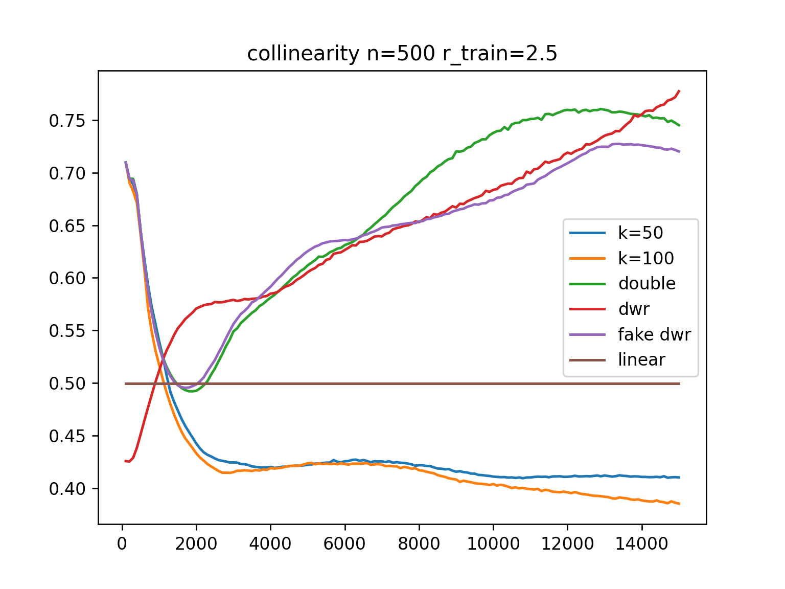

### S->V

    n = 100
    V_n=100.png" alt="" width="400">
    n = 200
    V_n=200.png" alt="" width="400">

    n = 500
    V_n=500.png" alt="" width="400">
    n = 1000
    V_n=1000.png" alt="" width="400">

    n = 1500
    V_n=1500.png" alt="" width="400">
    n = 2000
    V_n=2000.png" alt="" width="400">

### V->S

    n = 100
    S_n=100.png" alt="" width="400">
    n = 200
    S_n=200.png" alt="" width="400">

    n = 500
    S_n=500.png" alt="" width="400">
    n = 1000
    S_n=1000.png" alt="" width="400">

    n = 1500
    S_n=1500.png" alt="" width="400">
    n = 2000
    S_n=2000.png" alt="" width="400">

### S_|_V

    n = 100
    
    n = 200
    

    n = 500
    
    n = 1000
    

    n = 1500
    
    n = 2000
    

### collinearity

    n = 100
    
    n = 200
    

    n = 500
    
    n = 1000
    

    n = 1500
    
    n = 2000
    

