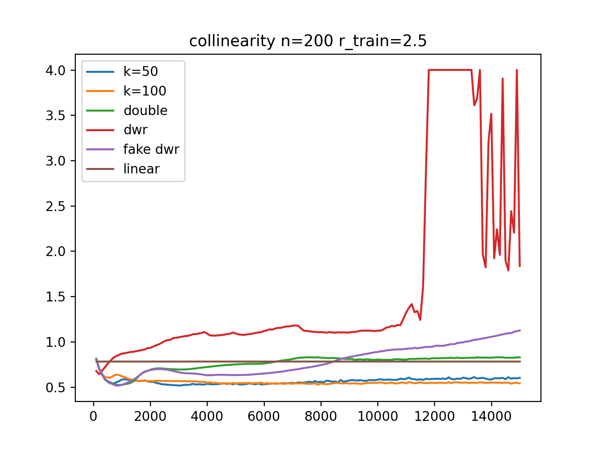

## 使用MLP版本
### 结果
- 在一部分setting下我们的方法更好，例如S->V小样本量和collinearity。
- 在其余setting下表现比较接近，很难总结规律
- 我们的方法依然更稳定
## 一些想法
- 只有加fitting loss比不加要明显好，才有可能比加反过来的fitting loss明显好
- 和离散情况一致，我们的方法decorelation loss往往更大
 。fitting loss几乎在训练过程中不变/逐渐变大
- 看起来加入我们设计的fitting loss对于MLP版本提升比较小。而对于离散版本的提升更大。
### S->V

    n = 100
    V_n=100.png" alt="" width="400">
    n = 200
    V_n=200.png" alt="" width="400">

    n = 500
    V_n=500.png" alt="" width="400">
    n = 1000
    V_n=1000.png" alt="" width="400">

    n = 1500
    V_n=1500.png" alt="" width="400">
    n = 2000
    V_n=2000.png" alt="" width="400">

### V->S

    n = 100
    S_n=100.png" alt="" width="400">
    n = 200
    S_n=200.png" alt="" width="400">

    n = 500
    S_n=500.png" alt="" width="400">
    n = 1000
    S_n=1000.png" alt="" width="400">

    n = 1500
    S_n=1500.png" alt="" width="400">
    n = 2000
    S_n=2000.png" alt="" width="400">

### S_|_V

    n = 100
    
    n = 200
    

    n = 500
    
    n = 1000
    

    n = 1500
    
    n = 2000
    

### collinearity

    n = 100
    
    n = 200
    

    n = 500
    
    n = 1000
    

    n = 1500
    
    n = 2000
    

