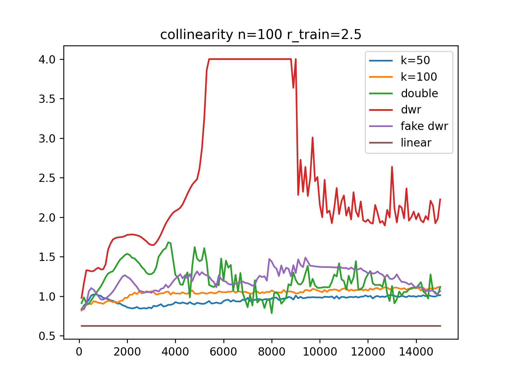
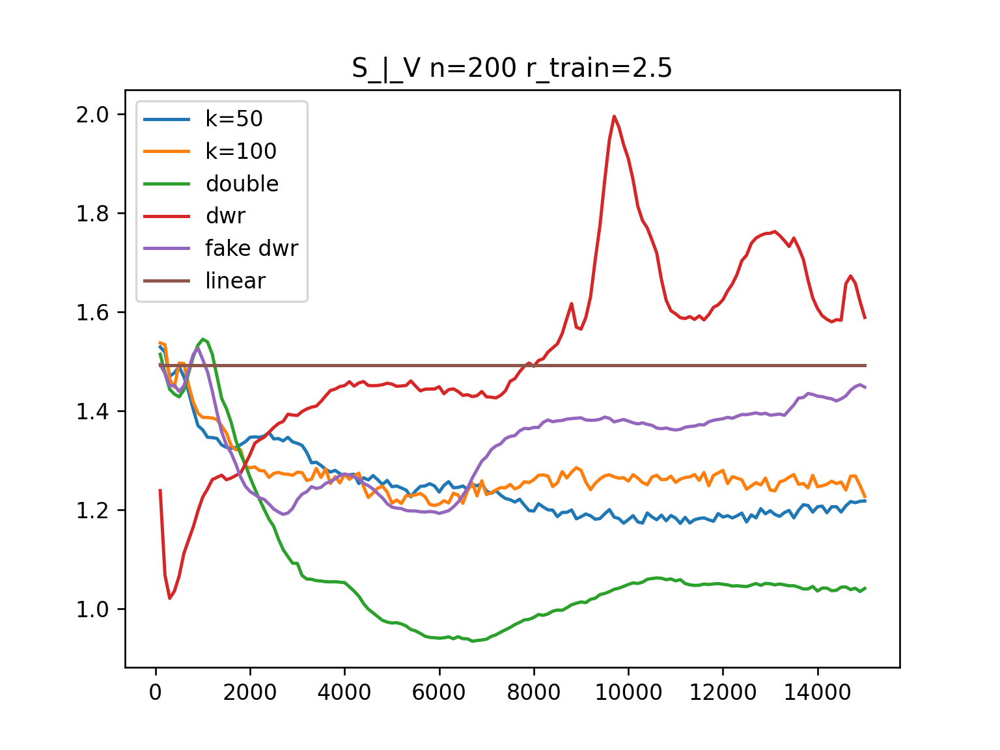
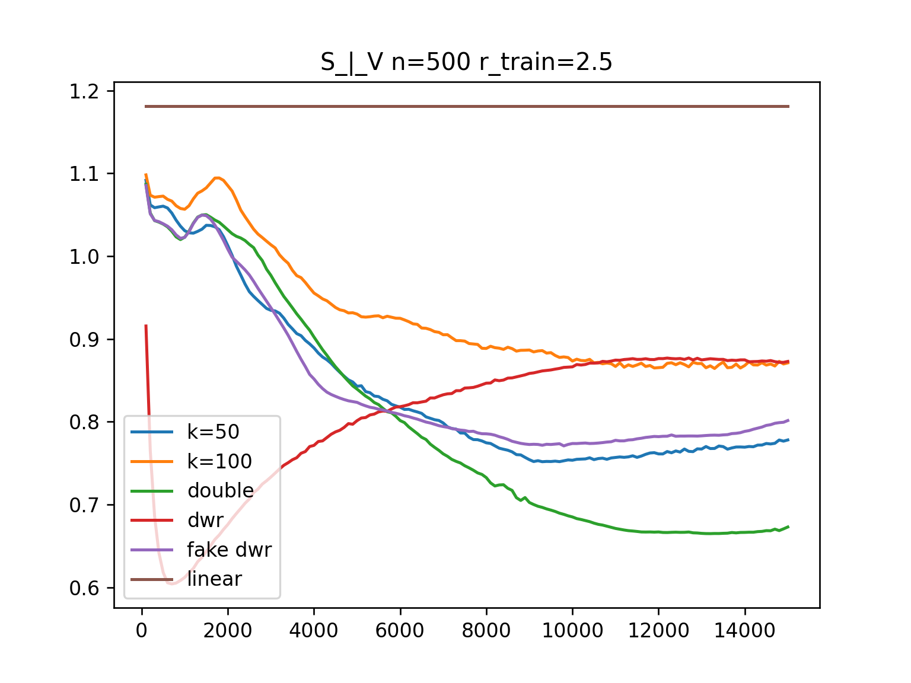

### n=100

    with DWR
    
    without DWR
    

    with DWR
    V_n=100.png" alt="" width="400">
    without DWR
    V_n=100_withoutDWR.png" alt="" width="400">

    with DWR
    
    without DWR
    

    with DWR
    S_n=100.png" alt="" width="400">
    without DWR
    S_n=100_withoutDWR.png" alt="" width="400">

### n=200

    with DWR
    
    without DWR
    

    with DWR
    V_n=200.png" alt="" width="400">
    without DWR
    V_n=200_withoutDWR.png" alt="" width="400">

    with DWR
    
    without DWR
    

    with DWR
    S_n=200.png" alt="" width="400">
    without DWR
    S_n=200_withoutDWR.png" alt="" width="400">

### n=500

    
    V_n=500.png" alt="" width="400">

    S_n=500.png" alt="" width="400">
    

### n=1000

    
    V_n=1000.png" alt="" width="400">

    S_n=1000.png" alt="" width="400">
    

### n=1500

    
    V_n=1500.png" alt="" width="400">

    S_n=1500.png" alt="" width="400">
    

### n=2000

    
    V_n=2000.png" alt="" width="400">

    S_n=2000.png" alt="" width="400">
    

