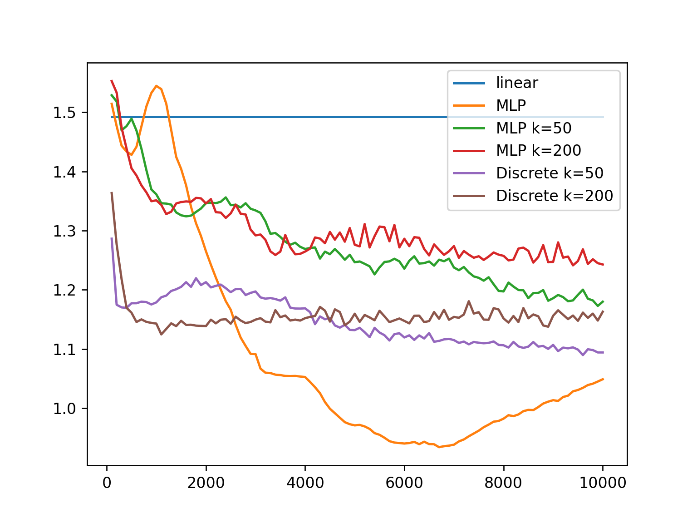
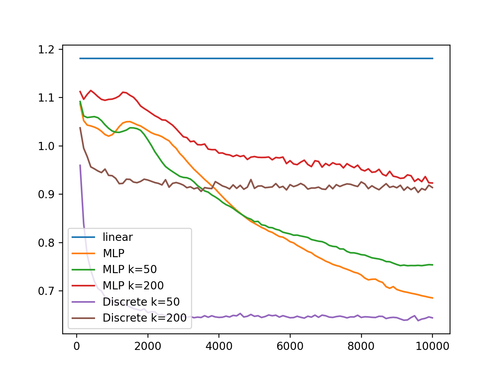
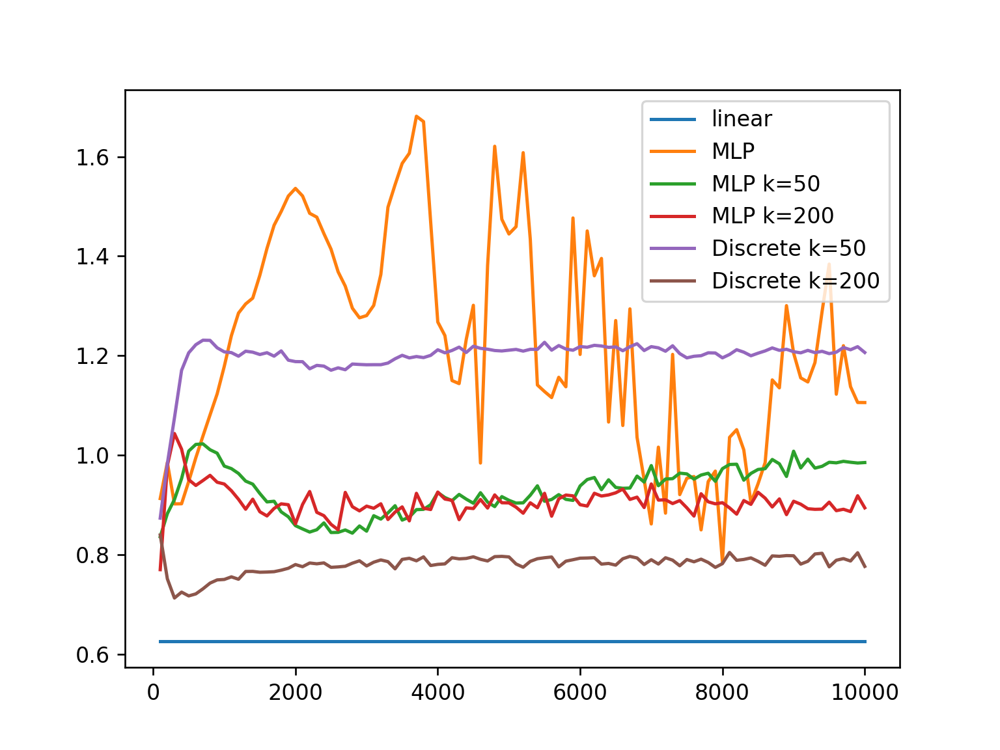

### S->V

    n = 100
    V_100.png" alt="" width="400">
    n = 200
    V_200.png" alt="" width="400">

    n = 500
    V_500.png" alt="" width="400">
    n = 1000
    V_1000.png" alt="" width="400">
    n = 2000
    V_2000.png" alt="" width="400">

### S_|_V

    n = 100
    
    n = 200
    

    n = 500
    
    n = 1000
    
    n = 2000
    

### V->S

    n = 100
    S_100.png" alt="" width="400">
    n = 200
    S_200.png" alt="" width="400">

    n = 500
    S_500.png" alt="" width="400">
    n = 1000
    S_1000.png" alt="" width="400">
    n = 2000
    S_2000.png" alt="" width="400">

### collinearity

    n = 100
    
    n = 200
    

    n = 500
    
    n = 1000
    
    n = 2000
    

