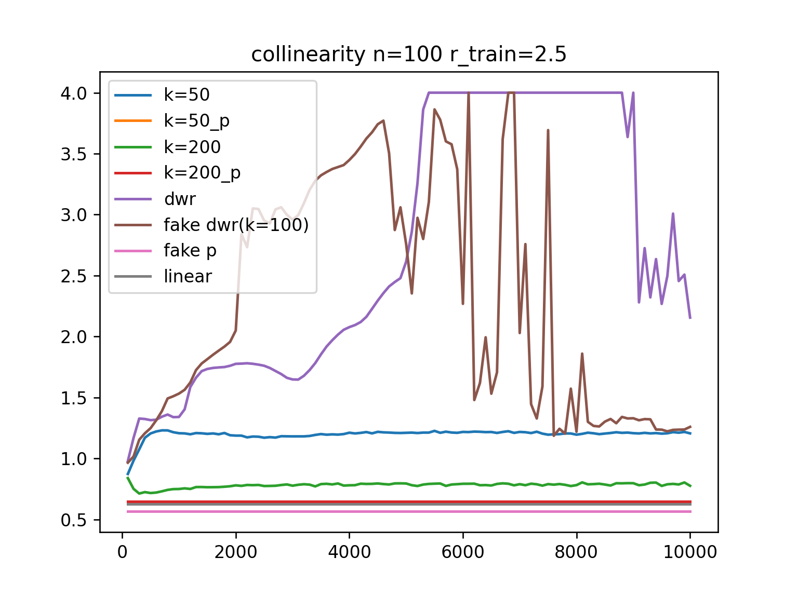

## 直接更新weight，不使用MLP版本
### 说明
- 我们的版本，尝试了k=50和k=200两个超参数 fitting loss = (max(weight) - weight) * loss
- dwr就是原本不加fitting loss的版本
- fake dwr是按照文章中的版本，fitting loss = weight * loss，尝试了超参数k=100。其他都相同
- 带后缀p的就是把迭代完成之后内层的Prediction model拿出来测试
### 初步结论
1. 所有setting下我们的表现随迭代次数都更稳定
2. 绝大部分setting下我们的方法prediction model比文章中的prediction model（带p后缀）表现好。
3. 提weight出来再重新训练一个模型（不带p）的效果也比文章中的要好
4. 一个重要的区别是，使用文章中的办法，decorrelation loss可以降低到和dwr差不多，fitting loss也一直在下降。而我们的方法decorrelation loss到最后依然很大，fitting loss也几乎不下降，二者像是在对抗中找一个平衡。而超参数k决定了平衡点的偏向。
### S->V

    n = 100
    V_n=100.png" alt="" width="400">
    n = 200
    V_n=200.png" alt="" width="400">

    n = 500
    V_n=500.png" alt="" width="400">
    n = 1000
    V_n=1000.png" alt="" width="400">

### V->S

    n = 100
    S_n=100.png" alt="" width="400">
    n = 200
    S_n=200.png" alt="" width="400">

    n = 500
    S_n=500.png" alt="" width="400">
    n = 1000
    S_n=1000.png" alt="" width="400">

### S_|_V

    n = 100
    
    n = 200
    

    n = 500
    
    n = 1000
    

### collinearity

    n = 100
    
    n = 200
    

    n = 500
    
    n = 1000
    

